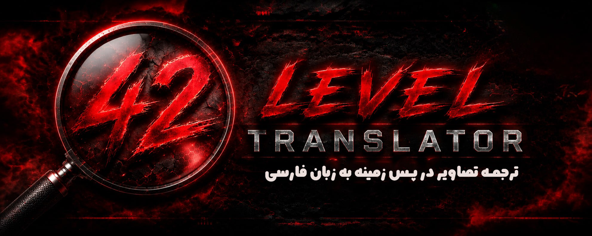

<p align="center">
  
</p>

<h1 align="center">42 Level Translator</h1>

<p align="center">
  <strong>ترجمه‌ی تصویر در پس‌زمینه  </strong>
</p>

<p align="center">
  
  
  
</p>

<p align="center">
  <b>
    <a href="#ویژگی‌ها">ویژگی‌ها</a> &nbsp;|&nbsp;
    <a href="#نصب">نصب</a> &nbsp;|&nbsp;
    <a href="#راهنمای-استفاده">راهنمای استفاده</a> &nbsp;|&nbsp;
    <a href="#تنظیمات">تنظیمات</a> &nbsp;|&nbsp;
    <a href="#تصاویر">تصاویر</a> &nbsp;|&nbsp;
    <a href="#حمایت">حمایت</a>
  </b>
</p>

---

## ✨ ویژگی‌ها

- **ترجمه‌ی خودکار تصویر** از کلیپ‌بورد (PrintScreen / Win+Shift+S / Ctrl+C روی عکس)
- **ابزار اسکرین‌شات داخلی** (مشابه Snipping Tool) با کلید **F3**
- **منوی شیشه‌ای تسک‌بار** با طراحی مدرن و راست‌چین
- **اجرای خودکار با شروع ویندوز**
- **قابلیت زوم و پَن** روی تصویر ترجمه‌شده
- **کپی سریع** تصویر ترجمه‌شده به کلیپ‌بورد
- **نوتیفیکیشن‌های شیشه‌ای** پایین صفحه

---

## 🚀 نصب

### پیش‌نیازها
- ویندوز ۱۰ یا ۱۱ (با WebView2 Runtime که اغلب از قبل نصب است)
- Python 3.8 یا بالاتر

### مراحل نصب

```bash
# کلون کردن ریپو
git clone https://github.com/mhbanaei/42-Level-Translator.git
cd 42-Level-Translator

# نصب وابستگی‌ها
pip install -r requirements.txt

# اجرا
python ClipTranslateOverlay.py

# 📋 ClipTranslateOverlay

A Python-based desktop utility that monitors your clipboard for image content, translates it **in the background** using Google Translate's image translation, saves the translated image to a folder of your choice, and shows it as a floating always-on-top overlay.

## 🎨 42LEVEL Branding

- **Icon**: the app keeps its original icon (rounded square with «A⇄ف»); the 42LEVEL logo (`assets/42logo.png`) is used inside the welcome popup and as the header icon of the result overlay
- **Fonts & RTL**: the whole UI uses the Vazirmatn (Vazir) font with a right-to-left layout (Persian text right-aligned, English left-aligned) — except the translation output image, which is untouched
- **Glassy tray menu**: the tray icon opens a modern, glassy (Windows Acrylic) RTL popup menu instead of the plain system menu
- **Built-in snipping tool (default F3, configurable)**: press the snip hotkey (default F3, changeable in Settings), drag a rectangle anywhere on the screen — the selection goes straight to the clipboard and gets translated automatically (like the Windows Snipping Tool)
- **Zoom on the translation output**: use the mouse wheel or the −/＋ buttons to zoom in/out on the translated image
- **Run on Windows startup**: optional checkbox in Settings that writes a `HKCU Run` registry entry so the app auto-starts with Windows
- **42OCR box**: shows at the **top-right corner** when the app launches (a short delay after start), and you can **re-open it anytime by right-clicking the tray icon**. It is **draggable** (position remembered) and shows the **42LEVEL banner** (`assets/banner.jpg`) on top with the **✕ close button drawn directly onto the banner** (never hidden behind it, always clickable), plus clickable links below (support page, YouTube, GitHub ×2, Twitch). Closing it with ✕ does **not** close the app — a pretty toast at the bottom of the screen confirms the app stays in the tray. It also auto-closes after 60 seconds

| | |
|---|---|
| درگاه حمایت مالی | https://reymit.ir/42level |
| کانال یوتیوب | https://www.youtube.com/@42LEVEL |
| گیت‌هاب | https://github.com/mhbanaei |
| گیت‌هاب | https://github.com/AghaErfan |
| کانال توییچ | https://www.twitch.tv/42level |

## ✨ Features

- 🕶️ **Fully background operation** — the Google Translate window is never shown; everything happens in a hidden off-screen browser
- 🖼️ Auto-detects images in clipboard (`PrintScreen`, `Win+Shift+S`, `Ctrl+C` on an image)
- 📥 Saves the translated result into your chosen folder (default: `Pictures\42OCR`)
- 📌 Shows the result as a beautiful floating overlay (rounded corners, dark theme, draggable, position remembered between runs, zoomable with the wheel or −/＋ buttons). It never steals focus, so it appears **on top of fullscreen games without Alt-Tab**
- 🎯 **Process/Window manager** (tray menu → «مدیریت فرآیندها»): pick a game/window and the snip hotkey captures that window's full image only — no manual rectangle needed
- 🎮 **In-game badge** («42OCR فعال است» bar above the game): shows when a target window is selected and **auto-hides after a configurable delay** (Settings → Display & Screenshot → «مخفی شدن خودکار نشانک بازی», default 30s, 0 = off). Its **«—» button** (and the same button in the floating menu) removes the whole in-game UI (badge + menu) from the screen instantly — it stays gone until you pick the window again from the Process Manager
- 🧹 **Wipe on exit** (optional, on by default): every time the app closes, the save folder is **permanently deleted** (Shift-Delete style, no recycle bin / recovery)
- ⚙️ Full **settings UI**, organized into **categories** (interface language / hotkeys / translation & saving / display & screenshot / system / advanced), each with its own card: **interface language** (Persian ⇄ English — the whole app switches instantly and is remembered), both hotkeys (overlay-close, default F2; screenshot, default F3), **selectable target language** (a dropdown with 10+ languages, not only Persian), save folder, auto-close timer, notifications, run-on-startup (registry), wipe-on-exit, and the focus window — all persisted in `%APPDATA%\42OCR\config.json` (a button in Settings opens the config folder)
- 🗂️ Tray menu: Settings / Screenshot / Process manager… / Translate a file… / Pause monitoring / Exit
- 📋 One-click **copy** of the translated image back to the clipboard from the overlay (no re-translation loop)
- 🔔 Optional system notification when the translation is ready

## 🔧 Requirements

- Python 3.8+
- Dependencies:

```bash
pip install wxPython pillow keyboard
```

```
py -m pip install wxPython
py -m pip install pillow
py -m pip install keyboard
```

- Microsoft Edge **WebView2 Runtime** (already installed on most Windows 10/11)

## 🚀 Usage

```bash
python ClipTranslateOverlay.py
```

- Copy a screenshot or image → the overlay appears with the translated image
- Press **F2** (or your custom hotkey) to close the overlay
- Right-click the tray icon for settings and options
- Run `python ClipTranslateOverlay.py --selftest` to verify the whole translation pipeline without a clipboard image

Settings are stored in `%APPDATA%\42OCR\config.json` (older `PantyOCR` configs are migrated automatically).

## 📦 Building the .exe

Requires PyInstaller:

```bash
pip install pyinstaller
python -m PyInstaller --noconfirm ClipTranslateOverlay.spec
```

The result is `dist\ClipTranslateOverlay.exe` (one-file, no console, 42 logo icon).

> **Important**: the spec bundles `WebView2Loader.dll` (from your wxPython package) into the exe. Without it, the hidden Google Translate browser silently falls back to the old IE engine and the in-page translation stops working — do not build without that binary.

## Credits

- Erfan Shariat / Hossein Banaei
