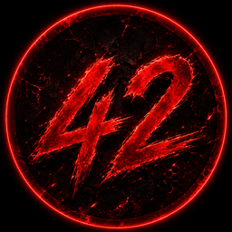

<p align="center">
  
</p>

<h1 align="center">42 Level Translator</h1>

<p align="center">
  <strong>ترجمه‌ی تصویر در پس‌زمینه + Overlay شناور + نمایش روی بازی‌ها</strong>
</p>

<p align="center">
  
  
  
  
</p>

<p align="center">
  <b>
    <a href="#ویژگی‌ها">ویژگی‌ها</a> &nbsp;|&nbsp;
    <a href="#نصب">نصب</a> &nbsp;|&nbsp;
    <a href="#راهنمای-استفاده">راهنمای استفاده</a> &nbsp;|&nbsp;
    <a href="#تنظیمات">تنظیمات</a> &nbsp;|&nbsp;
    <a href="#تصاویر">تصاویر</a> &nbsp;|&nbsp;
    <a href="#حمایت">حمایت</a>
  </b>
</p>

---

## ✨ ویژگی‌ها

- **ترجمه‌ی خودکار تصویر** از کلیپ‌بورد (PrintScreen / Win+Shift+S / Ctrl+C روی عکس)
- **ابزار اسکرین‌شات داخلی** (مشابه Snipping Tool) با کلید **F3**
- **منوی شیشه‌ای تسک‌بار** با طراحی مدرن و راست‌چین
- **اجرای خودکار با شروع ویندوز**
- **قابلیت زوم و پَن** روی تصویر ترجمه‌شده
- **کپی سریع** تصویر ترجمه‌شده به کلیپ‌بورد
- **نوتیفیکیشن‌های شیشه‌ای** پایین صفحه

---

## 🚀 نصب

### پیش‌نیازها
- ویندوز ۱۰ یا ۱۱ (با WebView2 Runtime که اغلب از قبل نصب است)
- Python 3.8 یا بالاتر

### مراحل نصب

```bash
# کلون کردن ریپو
git clone https://github.com/mhbanaei/42-Level-Translator.git
cd 42-Level-Translator

# نصب وابستگی‌ها
pip install -r requirements.txt

# اجرا
python ClipTranslateOverlay.py
